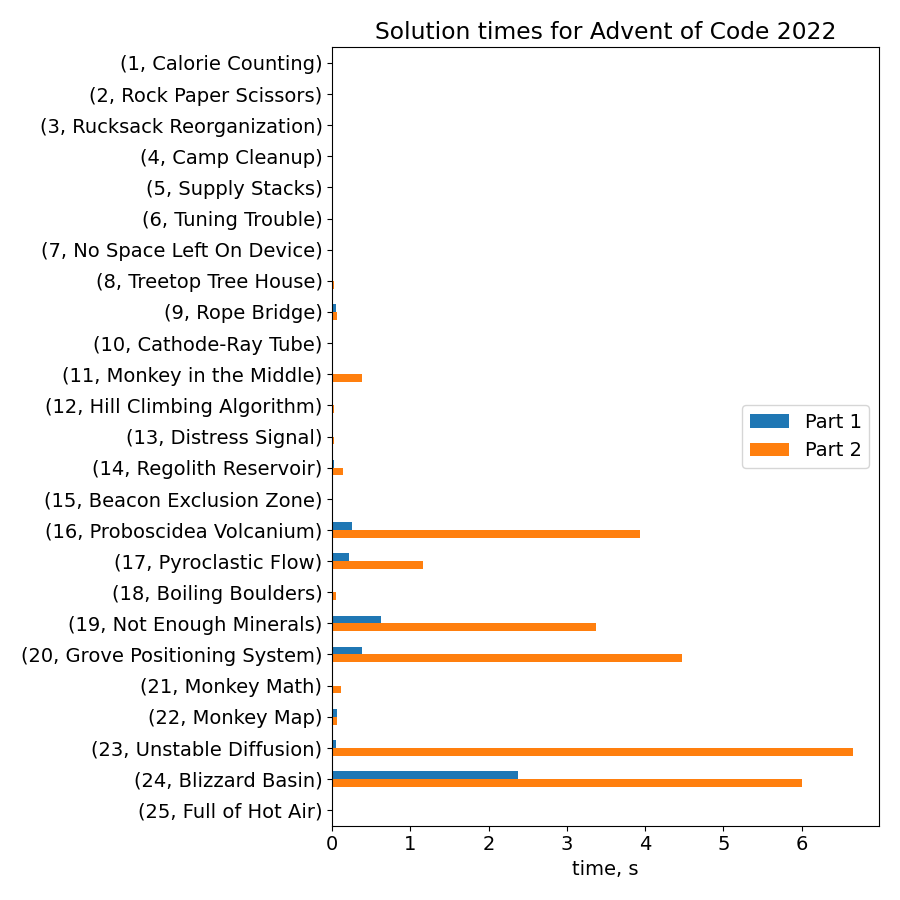

# Advent of Code 2022

My python solutions for all days of [Advent Of Code 2022](https://adventofcode.com/2022).

## Prerequisites

I ran this code on python 3.10.8. It might work on other python 3 versions too.

Create a virtual environment and install dependencies.

```
python -m venv venv
source venv/bin/activate
pip install -r requirements.txt
```

## Layout

Code for each day is in `src/day{i}.py`.

Inputs for each day are in `inputs/day{i}/test.txt` and `inputs/day{i}/task.txt`.

## Usage

Solve all tasks:

```bash
python src/solve.py
```

Solve particular day:

```bash
python src/solve.py --day {day}
```

Other options:

- `--test` - run on test input
- `--day {day} --input {filepath}` - run on a specified input file

## Animations

Some days include code to produce matplotlib animations illustrating the solution.

You can see them by running

```bash
python src/dayX.py
```

<div style="display: flex; column-gap: 20px; row-gap: 20px; flex-wrap: wrap">
<div>
<h3><a href="src/day8.py">Day 8</a></h3>
<a href="outputs/day8.png"></a>
</div>
<div>
<h3><a href="src/day9.py">Day 9</a></h3>
<a href="outputs/day9.png"></a>
</div>
<div>
<h3><a href="src/day10.py">Day 10</a></h3>
<a href="outputs/day10.png"></a>
</div>
<div>
<h3><a href="src/day12.py">Day 12</a></h3>
<a href="outputs/day12.png"></a>
</div>
<div>
<h3><a href="src/day14.py">Day 14</a></h3>
<a href="outputs/day14.png"></a>
</div>
<div>
<h3><a href="src/day22.py">Day 22</a></h3>
<a href="outputs/day22.png"></a>
</div>
<div>
<h3><a href="src/day24.py">Day 24</a></h3>
<a href="outputs/day24.png"></a>
</div>
</div>

## Solve times

Solve times from a single run on my computer. My worst performing day is apparently day 15 - Beacon Exclusion Zone. It takes a whole minute.

Days 20 and 24 could use some improvements too.


